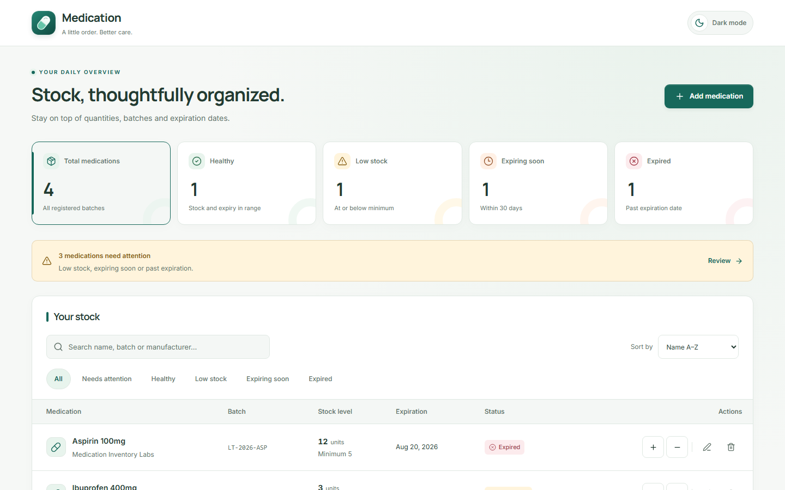
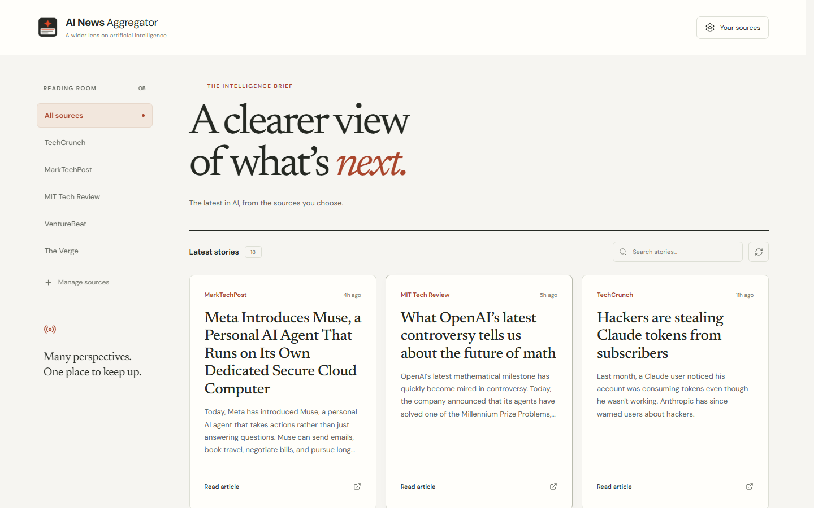
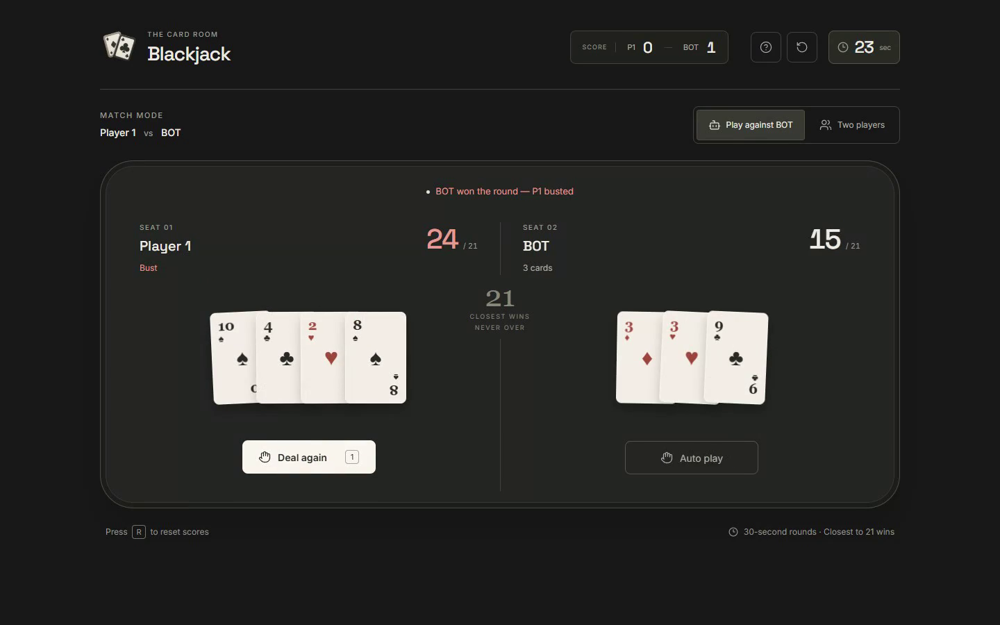

# Leone Marcos

**Software Engineer** focused on building responsive, resilient web applications with **React** and **TypeScript**.

[Portfolio](https://leonemarcos.com/) · [LinkedIn](https://www.linkedin.com/in/leone-marcos) · [Email](mailto:contact@leonemarcos.com)

---

## Featured Projects

### [Medication Inventory](https://github.com/LeoneMarcos/medication-inventory)

A responsive medication management workspace designed for reliable local stock control, batch expiration tracking, and safe inventory movements.

- **Problem:** Track medication batches, expiration dates, and stock levels in a lightweight browser workspace.
- **Engineering:** Built with React 19, TypeScript, and Tailwind CSS. Features atomic storage updates with quota-exceeded recovery, strict ISO date validation, and responsive desktop/mobile data tables.
- **Demo:** [inventory.leonemarcos.com](https://inventory.leonemarcos.com/)
- **Code:** [github.com/LeoneMarcos/medication-inventory](https://github.com/LeoneMarcos/medication-inventory)

---

### [AI News Aggregator](https://github.com/LeoneMarcos/AI-News-Aggregator)

A focused artificial intelligence news reader that aggregates curated RSS sources into a unified, distraction-free daily feed.

- **Problem:** Staying current on fast-moving AI developments is cluttered by noisy social feeds and disparate publication formats.
- **Engineering:** Built with React 19, TypeScript, and Vite. Implements client-side RSS parsing with proxy fallback, instant search with keyboard shortcuts (`Esc` clear), accessible ARIA landmarks, and progressive loading of available sources.
- **Demo:** [ainews.leonemarcos.com](https://ainews.leonemarcos.com/)
- **Code:** [github.com/LeoneMarcos/AI-News-Aggregator](https://github.com/LeoneMarcos/AI-News-Aggregator)

---

### [Blackjack](https://github.com/LeoneMarcos/blackjack)

A browser-based 21 card game featuring an automated dealer opponent, local multiplayer support, and session scoreboards.

- **Problem:** Delivering an authentic, smooth card-table experience in the browser with clear state transitions, accessible interaction, and predictable game logic.
- **Engineering:** Built with React 19, TypeScript, Tailwind CSS, and Vitest. Features shuffled decks, tested scoring helpers, and an optional computer opponent, animated card reveals, and responsive layout across devices.
- **Demo:** [blackjack.leonemarcos.com](https://blackjack.leonemarcos.com/)
- **Code:** [github.com/LeoneMarcos/blackjack](https://github.com/LeoneMarcos/blackjack)

---

## Core Technologies

- **Languages & Frameworks:** TypeScript, JavaScript, React 19, Vite
- **Styling & Design Systems:** Tailwind CSS, Responsive & Accessible UI
- **Testing & Quality:** Vitest, Playwright, ESLint, Prettier
- **Cloud & Deployment:** Cloudflare Pages/Workers, GitHub Actions